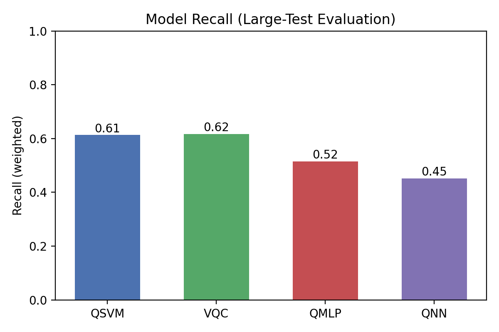
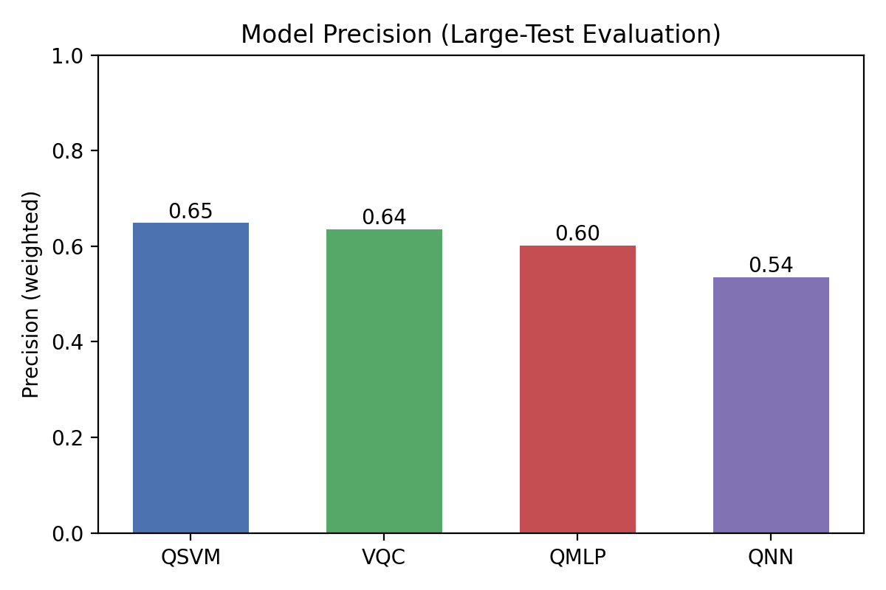
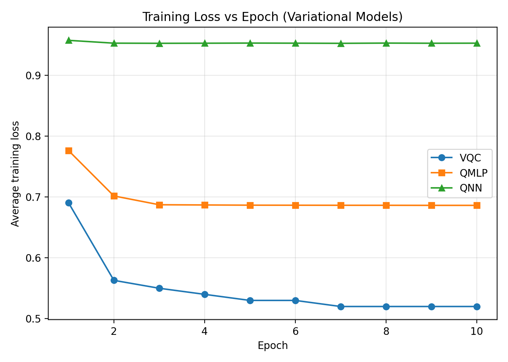
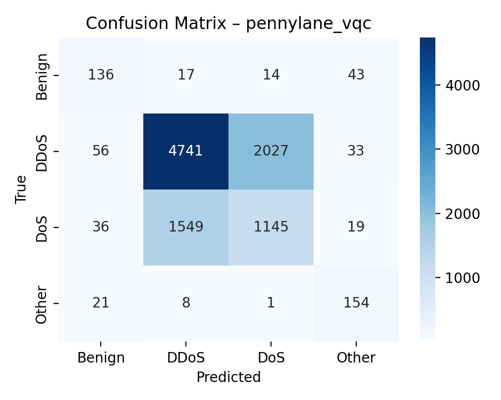
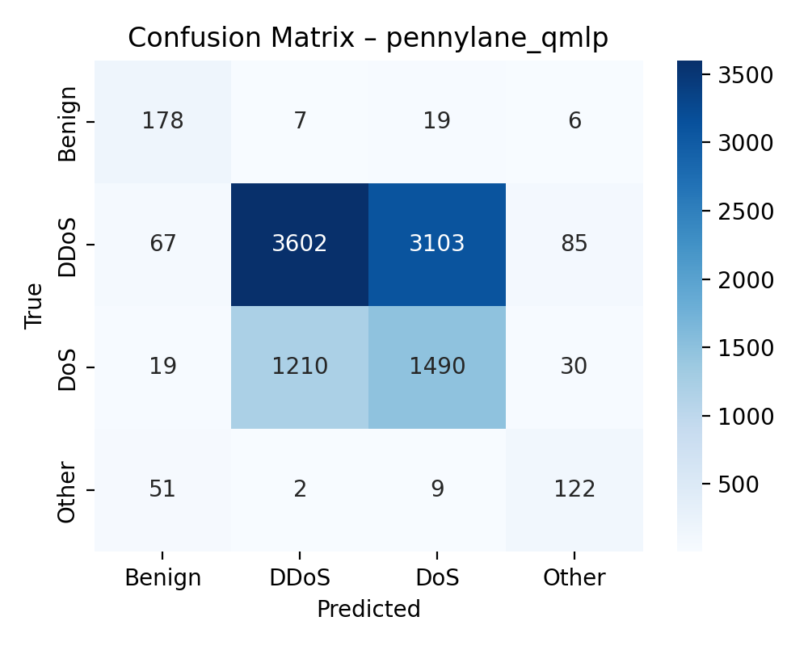
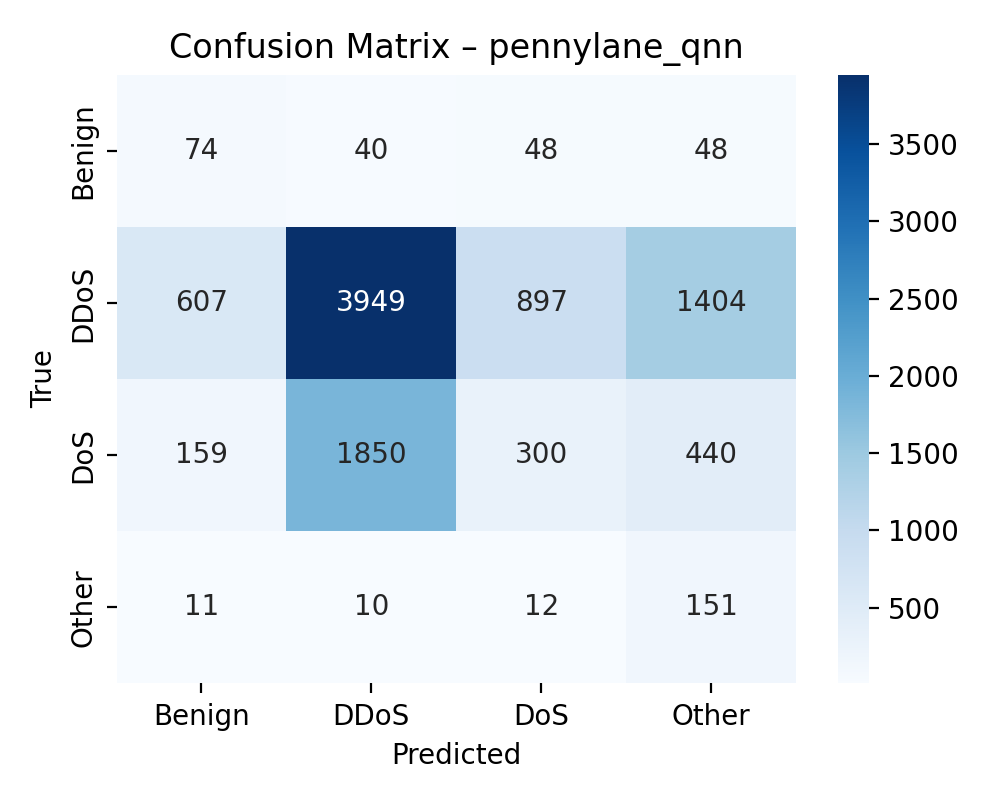

## Quantum Intrusion Detection – Experimental Report

### Overview

This report documents a series of quantum machine learning experiments on the CIC IoMT 2024 network intrusion dataset, using PennyLane implementations of:

- **QSVM** (`pennylane_qsvm`)
- **Variational Quantum Classifier (VQC)** (`pennylane_vqc`)
- **Quantum MLP (QMLP)** (`pennylane_qmlp`)
- **Quantum Neural Network (QNN)** (`pennylane_qnn`)

The primary goal is to compare these models on a 4-class intrusion detection task and to understand how architecture and training choices affect **attack detection performance** (recall), not just raw accuracy.

---

### Data Engineering and Preprocessing

- **Original labels**: 51+ fine-grained traffic/attack types from CIC IoMT 2024.
- **Collapsed meta-classes (4)**:
  - **Benign**: all normal traffic.
  - **DDoS**: any label containing `DDoS`.
  - **DoS**: any label containing `DoS` but not `DDoS`.
  - **Other**: reconnaissance, ARP spoofing, MQTT anomalies, etc.
- **Class mapping**: implemented via `_collapse_label` in `data/dataset.py`, overwriting the original `label` column to avoid target leakage.

#### Dataset variants

- **Variational dataset** – `CIC_IoMT_2024_Variational.parquet`
  - Built from the full train Parquet (~7.16M rows).
  - Per-meta-class capping:
    - If count ≤ 2,000 → keep **all** rows.
    - If 2,000 < count ≤ 15,000 → keep **all** rows.
    - If count > 15,000 → downsample to **15,000** rows.
  - Shuffled to remove temporal bias.
  - Final size: ~60,000 rows (balanced across the 4 meta-classes).
  - Used for: **VQC, QMLP, QNN**.

- **QSVM dataset** – `CIC_IoMT_2024_QSVM.parquet`
  - Stratified sample of **5,000** rows from the Variational dataset.
  - Allocation proportional to class frequencies with rounding correction.
  - Used for: **QSVM** (kernel complexity requires smaller N).

#### Feature preprocessing

- All numeric features:
  - **Standardized** with `StandardScaler` (zero mean, unit variance).
  - Optionally **reduced via PCA** to `n_components = 4`.
- Quantum models:
  - Use **4 qubits**.
  - Each model encodes up to 4 PCA components into rotation angles, so dimension reduction is aligned with the available qubit count.

---

### Model Architectures and Training Regime

- **QSVM** (`pennylane_qsvm`)
  - Quantum kernel via PennyLane; classical **SVC(kernel="precomputed")**.
  - Train set: **5,000** samples.
  - Kernel matrix: 5,000 × 5,000 (≈ 12.5M kernel circuits).

- **Variational models** (4 qubits, 4 outputs / meta-classes):
  - **VQC**: layered `Rot` gates + nearest-neighbor CNOT entanglement.
  - **QMLP**: `StronglyEntanglingLayers`.
  - **QNN**: `BasicEntanglerLayers`.

#### Epoch-based training (new implementation)

- Old approach: `max_iter` random mini-batch steps with optional early stopping → many samples never seen.
- New approach (`_BasePennyLaneVariational.fit`):
  - **Epochs** over the full training set:
    - `batch_size = 32`.
    - `steps_per_epoch = floor(60000 / 32) = 1,875`.
  - `max_iter` interpreted as **number of epochs**.
  - For these runs: **10 epochs** over ~60k samples.
  - Optimizer: `GradientDescentOptimizer` with `step_size = 0.1`.
  - Loss: MSE between Pauli-Z expectations and {-1, +1} one-hot targets.

This ensures every variational model sees (almost) all 60k samples per epoch and avoids the “only 3,200 samples ever seen” issue from the earlier mini-batch implementation.

---

### Evaluation Protocol

- **Training-time evaluation**:
  - For rapid feedback, training scripts used `n_test = 200` from `config/config.yaml` for initial test metrics.

- **Post-hoc large-test evaluation** (`experiments/evaluate_checkpoints.py`):
  - Loads saved **checkpoints** from the latest `results/run_YYYYMMDD_HHMM/` directory.
  - Rebuilds datasets using `get_dataset` with larger test subsets:
    - **Variational models**: `n_test_eval = 10,000`.
    - **QSVM**: `n_test_eval = 1,000` (kernel cost scales as `N_train × N_test`).
  - Computes:
    - **Accuracy**
    - **F1 (weighted)**
    - **Precision (weighted)**
    - **Recall (weighted)**
  - Saves metrics as:
    - `<model>_metrics_eval_large_test.json` in the `metrics/` subdirectory.

All reported comparisons below use these **large-test evaluation metrics**.

---

### Quantitative Results (Large-Test Evaluation)

#### Overall performance

From:

- `results/run_20260304_2332/metrics/pennylane_vqc_metrics_eval_large_test.json`
- `results/run_20260304_2332/metrics/pennylane_qnn_metrics_eval_large_test.json`
- `results/run_20260304_2322/metrics/pennylane_qmlp_metrics.json` (200-test run)
- `results/run_20260304_230109/metrics/pennylane_qsvm_metrics_eval_large_test.json`

**Table 1 – Performance summary**

| Model          | Framework | Train N | Test N (eval) | Accuracy | F1 (w) | Precision (w) | Recall (w) |
|----------------|-----------|---------|---------------|----------|--------|----------------|-----------|
| QSVM           | PennyLane | 5,000   | 1,000         | 0.6130   | 0.6254 | 0.6489         | 0.6130    |
| VQC            | PennyLane | 60,000  | 10,000        | 0.6174   | 0.6249 | 0.6359         | 0.6174    |
| QMLP           | PennyLane | 60,000  | 200           | 0.5150   | 0.5401 | 0.6014         | 0.5150    |
| QNN            | PennyLane | 60,000  | 10,000        | 0.4518   | 0.4767 | 0.5352         | 0.4518    |

**Key observations:**

- **Best overall performers**:
  - **VQC** and **QSVM** are essentially tied in performance:
    - VQC: accuracy 0.6174, recall 0.6174 (10k test).
    - QSVM: accuracy 0.6130, recall 0.6130 (1k test).
  - Both demonstrate substantially better-than-random 4-way classification.

- **QMLP**:
  - Accuracy/recall ≈ 0.515 on 200-test subset.
  - Performance is better than random guessing but notably below VQC/QSVM.

- **QNN**:
  - Underperforms with accuracy/recall ≈ 0.45 on 10k test.
  - Despite a deeper architecture, it fails to match even QMLP.

---

### Figures to Include

#### Figure 1 – Accuracy comparison (bar chart)

**Description**: Bar chart with models on the x-axis (`QSVM`, `VQC`, `QMLP`, `QNN`) and **accuracy** on the y-axis using the large-test metrics above.

**Insight**:

- VQC and QSVM achieve similar accuracy (~0.61), clearly outperforming QMLP (~0.52) and especially QNN (~0.45).

#### Figure 2 – Recall comparison (bar chart)

**Description**: Bar chart of **recall_weighted** for each model.

**Insight**:

- Recall is the critical metric for intrusion detection (percentage of attacks caught).
- VQC and QSVM both detect ~61% of attacks across the 4 meta-classes.
- QMLP and QNN detect substantially fewer attacks.

#### Figure 3 – Precision comparison (bar chart)

**Description**: Bar chart of **precision_weighted** per model.

**Insight**:

- QSVM has the highest precision (~0.649), followed by VQC (~0.636).
- This suggests their alarms are relatively “clean,” with fewer false positives than weaker models.

---

### Training Dynamics (Loss Curves)

Use the logged average epoch losses from the terminal outputs for each variational model to plot **loss vs. epoch**.

#### Figure 4 – Loss curve: VQC

**Expected shape**:

- Epoch 1: ~0.69
- Epoch 2: ~0.56
- Subsequent epochs: continued decrease or leveling near the optimum.

**Insight**:

- Strong and consistent loss reduction indicates a **well-conditioned optimization landscape** for VQC with the chosen step size and depth.

#### Figure 5 – Loss curve: QMLP

**Observed behavior**:

- Epoch 1: ~0.78
- Epoch 2: ~0.70
- Epochs 3–10: slowly decaying and **plateauing** around ~0.686.

**Insight**:

- QMLP does learn something initially but quickly saturates, corresponding to its moderate accuracy and recall.
- The plateau suggests the need for hyperparameter tuning (e.g., step size, depth) to escape shallow minima.

#### Figure 6 – Loss curve: QNN

**Observed behavior**:

- Loss remains high (~0.95) and relatively flat across epochs.

**Insight**:

- QNN likely suffers from optimization difficulties (e.g., barren plateaus) at this depth and qubit count.
- Despite a more expressive circuit, it fails to train effectively on this dataset under the current hyperparameters.

---

### Confusion Matrices

For each model (QSVM, VQC, QMLP, QNN), compute and plot a **4×4 confusion matrix** on the large evaluation set:

- Rows: true labels (`Benign`, `DDoS`, `DoS`, `Other`).
- Columns: predicted labels.

#### Figure 7 – QSVM confusion matrix

**What to highlight**:

- How well QSVM separates `Benign` from each attack class.
- Whether certain attack types (e.g. `DDoS` vs `DoS`) are more confusable.

#### Figure 8 – VQC confusion matrix

**What to highlight**:

- Compare to QSVM:
  - Are VQC’s errors concentrated on a particular class (e.g., `Other`)?
  - Does VQC more cleanly isolate `Benign` vs attack traffic?

#### Figures 9 & 10 – QMLP and QNN confusion matrices

**What to highlight**:

- Where these weaker models fail:
  - Misclassifying attacks as `Benign` (dangerous).
  - Confusing specific attack families (`DDoS` vs `DoS`).

---

